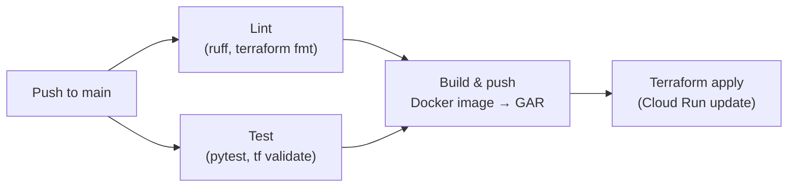

# Infrastructure

The Curator runs entirely on GCP. All resources are provisioned and managed by Terraform.

## GCP resources

| Resource | Name | Purpose |
| --- | --- | --- |
| Cloud Run service | `podcast-service` | Hosts the FastMCP server |
| GCS bucket | `the-curator-podcast-data` | Episode audio storage (public read) |
| GCS bucket | `the-curator-oauth-state` | OAuth state persistence (private) |
| Service account | `podcast-service@...` | Cloud Run identity with scoped permissions |
| Secret Manager | `google-client-id`, `google-client-secret`, `allowed-email` | OAuth credentials |
| Artifact Registry | `the-curator/the-curator-bot` | Container image storage |

## IAM summary

The `podcast-service` service account has exactly the permissions it needs and no more:

| Permission | Resource | Why |
| --- | --- | --- |
| `roles/storage.objectAdmin` | `the-curator-podcast-data` | Upload episode audio |
| `roles/storage.objectAdmin` | `the-curator-oauth-state` | Read/write OAuth state |
| `roles/aiplatform.user` | Project | Call Vertex AI (Gemini + TTS) |
| `roles/secretmanager.secretAccessor` | Each secret | Read OAuth credentials at startup |

## CI/CD pipeline

The [Deploy workflow](https://github.com/TheWinterShadow/The-Curator/actions/workflows/deploy.yml) runs on every push to `main`:

## Docs pipeline

The [docs workflow](https://github.com/TheWinterShadow/The-Curator/actions/workflows/docs.yml) rebuilds and deploys this site to GitHub Pages whenever `docs/`, `src/`, or `zensical.toml` changes on `main`.

## Detailed pages

- [Docker](docker.md) — image structure, build args, and local usage
- [Terraform](terraform.md) — full resource reference and deployment steps
