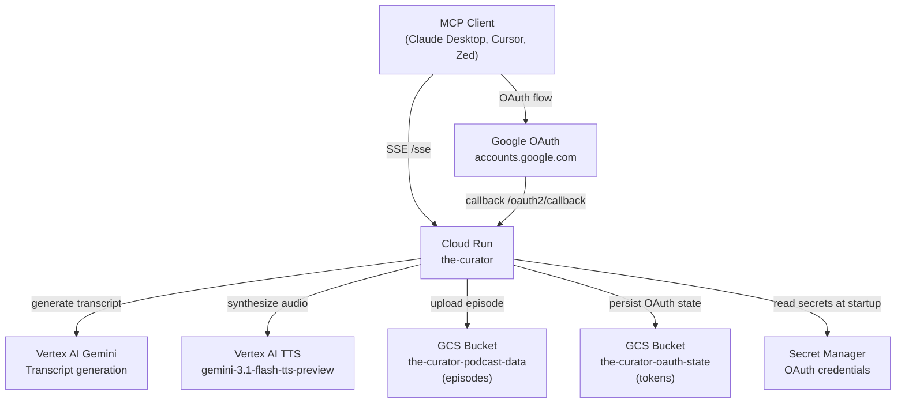
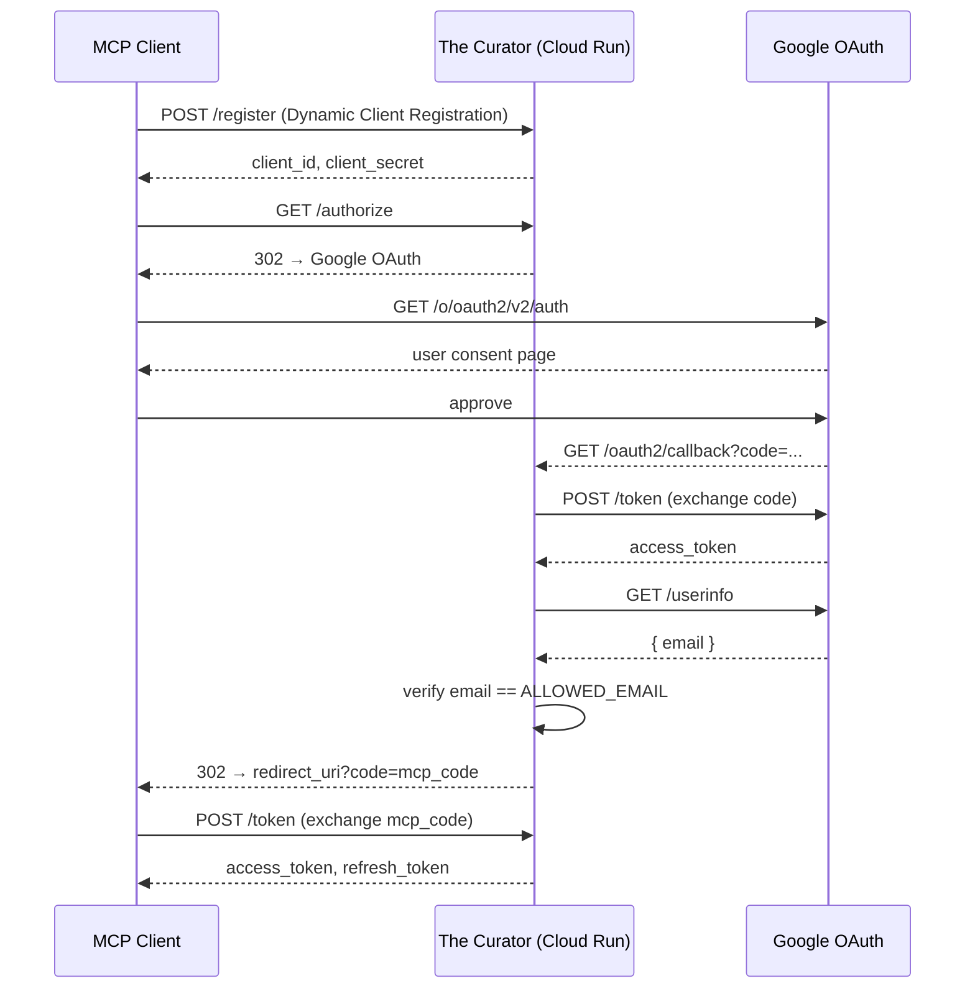
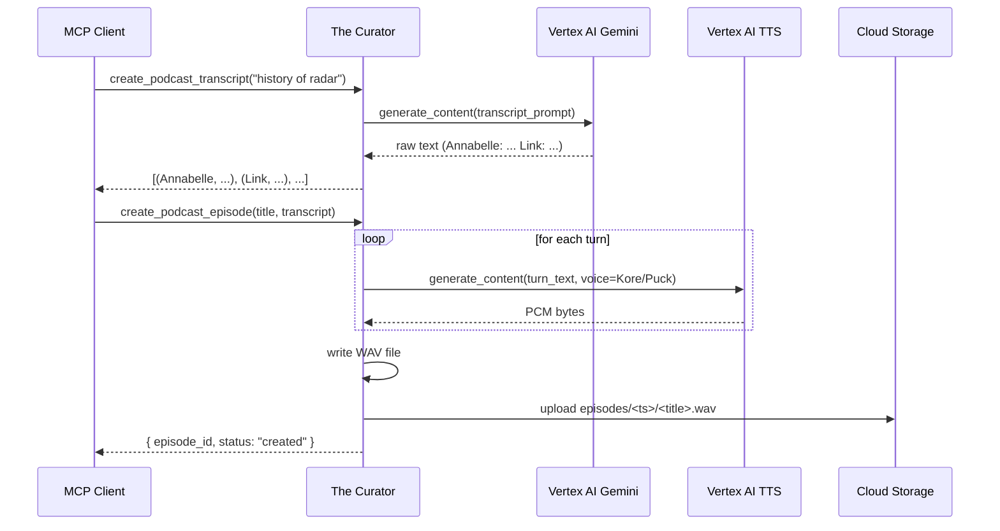

# Architecture

## System diagram

## Component breakdown

### FastMCP server ([`main.py`](../api/main.md))

The entry point. Wraps two MCP tools and wires together:

- The `GoogleOAuthProvider` as the MCP auth server
- A `PodcastGeneration` instance for tool execution
- Custom Starlette routes for `/health` and `/oauth2/callback`

Runs as a Gunicorn + Uvicorn process inside Docker on port 8080.

### Google OAuth provider ([`auth/provider.py`](../api/auth/provider.md))

Implements `OAuthAuthorizationServerProvider` from the MCP SDK. Delegates identity to Google but owns the full OAuth 2.1 state machine: client registration, authorization codes, access tokens, and refresh tokens. All state is serialized to JSON and written to GCS after every mutation.

### Podcast generation ([`podcast_generation.py`](../api/podcast_generation.md))

Orchestrates the two-step generation pipeline:

1. Calls `VertexClient.generate_content()` with the transcript prompt → parses the response into `(speaker, text)` turns.
2. Calls `VertexClient.synthesize_conversation()` → collects PCM frames → writes a WAV file.

### Vertex client ([`utils/vertex_client.py`](../api/utils/vertex_client.md))

Thin wrapper around three Google SDK clients:

- `genai.Client` (regional, `us-central1`) — Vertex AI TTS
- `genai.Client` (global) — Gemini transcript generation
- `anthropic.AnthropicVertex` — optional Claude routing (for models prefixed with `claude`)

## Data flows

### First-time authentication

### Podcast generation

## Infrastructure

All GCP resources are managed by Terraform in [`terraform/`](../infrastructure/terraform.md):

| Resource | Purpose |
| --- | --- |
| `google_cloud_run_v2_service.podcast_service` | Hosts the FastMCP server |
| `google_storage_bucket.podcast_data` | Episode audio storage (public read) |
| `google_storage_bucket.oauth_state` | OAuth state persistence (private) |
| `google_secret_manager_secret.*` | OAuth credentials injected at runtime |
| `google_service_account.podcast_service` | Cloud Run identity with scoped IAM |
